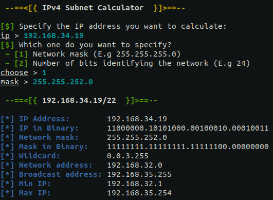

# IPv4 Subnet Calculator


## Quick Start
### Linux & Mac:
```sh
git clone https://github.com/0l1v3rr/subnet-calculator.git
cd subnet-calculator
make run
```

### Windows: (Only works on Git Bash)
```sh
git clone https://github.com/0l1v3rr/subnet-calculator.git
cd subnet-calculator
go run cmd/subnet-calculator/main.go
```

### Termux:
```sh
pkg update -y && pkg upgrade -y
pkg install git
pkg install golang
pkg install make
git clone https://github.com/0l1v3rr/subnet-calculator.git
cd subnet-calculator
make run
```