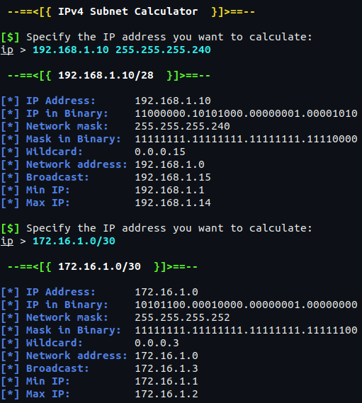

# IPv4 Subnet Calculator


## Specifying the IP address and the mask
There are 3 ways you can specify the IP and the mask.
1. `<ip>`
   - Example: `192.168.0.1`
   - In this case, the program will use the default mask.
2. `<ip>/<bits>`
   - Example: `192.168.0.1/24`
3. `<ip> <mask>`
   - Example: `192.168.0.1 255.255.255.0`

<br>
You can see 2 more examples in the screenshot.

## Quick Start
### Linux & Mac:
```sh
git clone https://github.com/0l1v3rr/subnet-calculator.git
cd subnet-calculator
make run
```

### Windows: (Only works on Git Bash)
```sh
git clone https://github.com/0l1v3rr/subnet-calculator.git
cd subnet-calculator
go run cmd/subnet-calculator/main.go
```

### Termux:
```sh
pkg update -y && pkg upgrade -y
pkg install git
pkg install golang
pkg install make
git clone https://github.com/0l1v3rr/subnet-calculator.git
cd subnet-calculator
make run
```